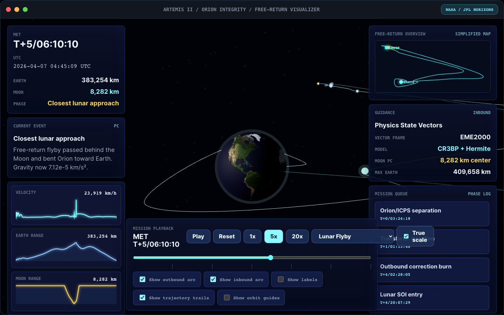

# Artemis II Free-Return Visualizer

Visualizzatore WebGL interattivo della traiettoria free-return di Artemis II, costruito con Vite, TypeScript e Three.js. L'app riproduce una console missione ispirata ai sistemi di navigazione spaziale: rendering 3D di Terra, Luna, Orion e traiettoria, pannelli telemetrici, timeline missione, mini-map, grafici di range e controlli di playback.



## Cosa Fa

- Mostra una scena 3D interattiva con Terra, Luna, stelle, guide orbitali e traiettoria Artemis II.
- Permette di orbitare, zoomare e ispezionare la scena con mouse/trackpad.
- Riproduce la timeline missione da lancio a splashdown con play, reset e velocita 1x, 5x e 20x.
- Visualizza eventi missione: launch, Orion/ICPS separation, translunar injection, outbound correction burn, lunar SOI entry, closest lunar approach, maximum Earth distance, return correction burn, entry interface e splashdown.
- Mostra telemetria dinamica: Mission Elapsed Time, UTC, distanza dalla Terra, distanza dalla Luna, velocita, fase corrente e stato fisico.
- Include toggles per archi outbound/inbound, labels, trail della traiettoria e orbit guides.
- Usa texture fotorealistiche locali: Blue Marble NASA/MODIS per la Terra e NASA Scientific Visualization Studio/LRO per la Luna.

## Come E Stato Sviluppato

Il progetto e stato creato da zero come app Vite in una cartella inizialmente vuota. La parte visuale e costruita direttamente in Three.js senza framework UI, per mantenere il rendering 3D centrale e ridurre overhead.

Stack principale:

- Vite per sviluppo locale e build production.
- TypeScript per tipizzazione del modello fisico, eventi missione e UI.
- Three.js per WebGL, camera prospettica, luci, materiali planetari, traiettorie e controlli orbitali.
- Playwright Core per smoke test automatico in browser headless.

La UI e stata modellata sull'immagine di riferimento: tema scuro, pannelli laterali semitrasparenti, traiettoria ciano, mini-map in alto a destra, queue missione e controllo playback in basso.

## Dati Missione

L'app usa dati pubblici NASA per date, durata e milestones principali di Artemis II:

- Lancio: 2026-04-01 22:35 UTC.
- Durata missione: 9 giorni, 1 ora, 32 minuti.
- Profilo: crewed lunar flyby con traiettoria free-return.
- Pericentro lunare visualizzato: 8,282 km dal centro della Luna.

Fonti:

- NASA Artemis II mission page: https://www.nasa.gov/mission/artemis-ii/
- NASA Artemis II press kit: https://www.nasa.gov/artemis-ii-press-kit/
- NASA Artemis II launch gallery: https://www.nasa.gov/gallery/artemis-ii-launch/
- NASA postflight assessment: https://www.nasa.gov/missions/nasa-on-track-for-future-missions-with-initial-artemis-ii-assessments/
- Texture Terra Blue Marble NASA/MODIS via Wikimedia Commons: https://commons.wikimedia.org/wiki/File:Land_shallow_topo_2048.jpg
- Texture Luna NASA Scientific Visualization Studio via Wikimedia Commons: https://commons.wikimedia.org/wiki/File:Moon_texture.jpg

## Come Funziona

La scena usa un sistema di coordinate Terra-Luna scalato in chilometri. Le posizioni reali vengono convertite in coordinate scena tramite un fattore di scala costante, mentre i raggi planetari hanno un controllo separato per mantenere leggibile il rendering.

Il modello fisico combina:

- parametri gravitazionali standard di Terra e Luna;
- posizione lunare lungo un'orbita media con periodo siderale reale;
- campionamento della traiettoria Orion tramite keyframe missione;
- interpolazione Hermite per una curva continua;
- vincolo di pericentro lunare per evitare che l'interpolazione attraversi la Luna;
- calcolo dinamico di range, velocita e accelerazione gravitazionale Terra-Luna.

Questo non e un propagatore astrodinamico certificato NASA/JPL, ma un visualizzatore fisicamente plausibile basato su dati missione reali e costanti astronomiche standard. L'obiettivo e rendere la geometria free-return, le distanze e le fasi missione comprensibili e interattive.

## Installazione

Prerequisiti:

- Node.js moderno.
- npm.

Installa le dipendenze:

```bash
npm install
```

Avvia il server di sviluppo:

```bash
npm run dev
```

Apri:

```text
http://127.0.0.1:5173/
```

## Script Disponibili

Build production:

```bash
npm run build
```

Preview production:

```bash
npm run preview
```

Smoke test browser/WebGL:

```bash
node scripts/smoke-test.mjs
```

Lo smoke test verifica:

- disponibilita WebGL;
- canvas renderizzato e non vuoto;
- assenza di errori console;
- funzionamento di play, reset, timeline e toggles;
- generazione screenshot in `output/playwright/artemis-smoke.png`.

## Struttura Progetto

```text
.
├── index.html
├── package.json
├── scripts/
│   └── smoke-test.mjs
├── src/
│   ├── assets/
│   │   └── earth-blue-marble-3840.jpg
│   ├── main.ts
│   ├── style.css
│   └── vite-env.d.ts
├── tsconfig.json
└── vite.config.ts
```

## Rendering

La Terra usa una texture equirettangolare fotorealistica Blue Marble, caricata localmente con `THREE.TextureLoader`, `SRGBColorSpace` e anisotropic filtering. La Luna usa una texture equirettangolare NASA SVS/LRO con mari, crateri e albedo reali. La traiettoria e renderizzata con linee Three.js, marker missione e trail dinamico.

## Licenze E Crediti

I dati missione provengono da fonti NASA pubbliche. Le texture Terra Blue Marble/MODIS e Luna NASA SVS/LRO sono distribuite come materiale pubblico NASA tramite Wikimedia Commons. Il codice applicativo e pronto per essere pubblicato come repository personale; aggiungere una licenza esplicita se si vuole permettere riuso pubblico formale.
